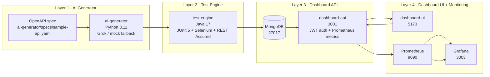

# QA Intelligence Platform

[](https://github.com/VishakhaGupta1/qa-intelligence-platform/actions/workflows/qa-pipeline.yml)
[]
[]

> AI-powered API and UI test generation, automated execution, and real-time quality intelligence dashboard.

## What It Does

The platform reads an OpenAPI specification, generates executable Java tests, and runs API plus UI validation against the application under test. Results are persisted to MongoDB so execution history, defects, and coverage can be tracked over time.

The four layers work together as a generation engine, an execution engine, a dashboard API, and a React UI. AI generates tests from the spec, Java executes them, the API stores and serves the results, and the dashboard shows coverage, defects, flakiness, and gap analysis.

What you see in the dashboard is the operational view of that pipeline: test volume, pass/fail trends, defect breakdowns, gap reports, and Prometheus-backed service metrics.

## Architecture



Layer 1 turns the API contract into tests. Layer 2 executes the generated Java suite and records results. Layer 3 exposes authenticated data and metrics. Layer 4 visualizes quality and system health.

## Quick Start

Prerequisites:

- Docker 24+
- Java 17+
- Python 3.11+
- Node 20+

1. Generate local secrets.

	```bash
	git clone https://github.com/VishakhaGupta1/qa-intelligence-platform.git
	cd qa-intelligence-platform
	bash scripts/generate-secrets.sh
	```

	Expected output: the repository is checked out, `.env` is created, and the script prints a checklist.

2. Start the local stack.

	```bash
	docker compose up -d --build
	```

	Expected output: MongoDB, dashboard-api, Selenium, Prometheus, and Grafana start.

3. Run the generator.

	```bash
	python ai-generator/main.py --spec ai-generator/specs/sample-api.yaml
	```

	Expected output: generated test sources are written to the test-engine module.

4. Run the Java suite.

	```bash
	mvn -f test-engine/pom.xml test
	```

	Expected output: `Tests run: 14, Failures: 0, Errors: 0, Skipped: 0`.

5. Run the Python unit tests.

	```bash
	python -m unittest discover -s ai-generator/tests -p "test_*.py"
	```

	Expected output: `Ran 8 tests` and `OK`.

6. Start the dashboard UI.

	```bash
	npm --prefix dashboard-ui run dev
	```

	Expected output: Vite serves the UI on `http://localhost:5173`.

7. Open the dashboard.

	```text
	http://localhost:5173
	```

## Environment Variables

### AI Generator

| Variable | Required | Default | Description |
| --- | --- | --- | --- |
| `GROK_API_KEY` | Yes | empty | Grok API key for test generation. |
| `GROK_URL` | No | `https://api.grok.ai/v1/generate` | Grok endpoint override. |
| `ANTHROPIC_API_KEY` | No | empty | Optional fallback key. |
| `BASE_URL` | No | `http://localhost:4000` | Application under test. |
| `HEADLESS` | No | `true` | Runs browser tests headlessly. |
| `USE_MOCK` | No | `true` | Uses mock AI responses for local development. |
| `ALLOW_MOCK_FALLBACK` | No | `true` | Allows mock output when no live provider is configured. |
| `SELENIUM_REMOTE_URL` | No | `http://127.0.0.1:4444/wd/hub` | Remote Selenium endpoint. |

### Test Engine

| Variable | Required | Default | Description |
| --- | --- | --- | --- |
| `BASE_URL` | No | `http://localhost:4000` | Target application base URL. |
| `HEADLESS` | No | `true` | Runs browser flows headlessly. |
| `SELENIUM_REMOTE_URL` | No | `http://127.0.0.1:4444/wd/hub` | Selenium endpoint for UI runs. |
| `MONGO_URI` | No | empty | MongoDB URI used by result persistence. |
| `MONGO_DB_NAME` | No | `qa_platform` | MongoDB database name. |

### Dashboard API

| Variable | Required | Default | Description |
| --- | --- | --- | --- |
| `PORT` | No | `3001` | API listen port. |
| `CORS_ORIGINS` | No | `http://localhost:5173,http://127.0.0.1:5173` | Allowed dashboard origins. |
| `JWT_SECRET` | Yes | empty | JWT signing secret. |
| `CLIENT_SECRET` | Yes | empty | Bootstrap secret for minting JWTs. |
| `JWT_EXPIRES_IN` | No | `1h` | JWT lifetime. |
| `METRICS_ALLOWED_SUBNETS` | No | `127.0.0.1,::1,172.16.0.0/12` | Allowlist for `/metrics`. |
| `MONGO_USERNAME` | No | `qa_platform_app` | MongoDB app username. |
| `MONGO_PASSWORD` | No | `change-me` | MongoDB app password. |
| `MONGO_HOST` | No | `127.0.0.1` | MongoDB host. |
| `MONGO_PORT` | No | `27017` | MongoDB port. |
| `MONGO_AUTH_SOURCE` | No | `qa_platform` | MongoDB auth database. |
| `MONGO_MAX_POOL_SIZE` | No | `20` | Driver pool size. |
| `MONGO_SERVER_SELECTION_TIMEOUT_MS` | No | `5000` | Server selection timeout. |
| `MONGO_CONNECT_TIMEOUT_MS` | No | `5000` | Connection timeout. |

### Dashboard UI

| Variable | Required | Default | Description |
| --- | --- | --- | --- |
| `VITE_API_BASE_URL` | No | `http://localhost:3001/api` | Base URL used by the React client. |

### Monitoring

| Variable | Required | Default | Description |
| --- | --- | --- | --- |
| `GRAFANA_ADMIN_PASSWORD` | Yes | `change-me-to-a-long-random-string` | Grafana admin password. |
| `BACKUP_DIR` | No | `/backups` | Mongo backup target directory. |

## Running Tests

Java API + UI suite:

```bash
mvn -f test-engine/pom.xml test
```

Expected output: `Tests run: 14, Failures: 0, Errors: 0, Skipped: 0`.

Python unit tests:

```bash
python -m unittest discover -s ai-generator/tests -p "test_*.py"
```

Expected output: `Ran 8 tests` and `OK`.

Full end-to-end pipeline:

```bash
docker compose up -d --build
python ai-generator/main.py --spec ai-generator/specs/sample-api.yaml
mvn -f test-engine/pom.xml test
```

Expected output: generated Java tests land in `test-engine/src/test/java/com/qaplatform/api/`, the Java suite reports `14/14`, and the Python suite reports `8/8`.

## API Endpoints

| Method | Path | Auth | Description |
| --- | --- | --- | --- |
| `POST` | `/api/auth/token` | No | Exchanges `CLIENT_SECRET` for a JWT Bearer token. |
| `GET` | `/health` | No | API health check. |
| `GET` | `/ready` | No | Readiness check that verifies the MongoDB connection. |
| `GET` | `/metrics` | No, IP restricted | Prometheus metrics endpoint. |
| `GET` | `/api/health` | Yes | Authenticated API health endpoint. |
| `GET` | `/api/results` | Yes | Returns test results, stats, paging, and optional status filtering. |
| `GET` | `/api/results/trend` | Yes | Returns daily pass-rate trends. |
| `GET` | `/api/defects` | Yes | Returns defect logs with optional severity filtering. |
| `GET` | `/api/coverage` | Yes | Returns coverage summary with optional tag filtering. |
| `GET` | `/api/flakiness` | Yes | Returns flaky tests filtered by threshold. |
| `GET` | `/api/gap-report` | Yes | Returns the latest AI-generated gap report. |
| `GET` | `/api/metrics` | Yes | Returns Mongo-backed operational metrics. |

See [docs/api-reference.md](docs/api-reference.md) for full request and response details.

## Monitoring

Grafana: http://localhost:3003

Prometheus: http://localhost:9090

Key metrics to watch:

- `qa_api_requests_total` for request volume and status codes.
- `qa_api_duration_seconds` for p50, p95, and p99 latency.
- `qa_test_results_total` for total stored results.
- `qa_grok_calls_total` for Grok usage.
- `process_resident_memory_bytes` and `process_cpu_seconds_total` for Node.js resource usage.

To inspect metrics directly:

```bash
curl http://localhost:3001/metrics
```

See [monitoring/PRODUCTION_MONITORING.md](monitoring/PRODUCTION_MONITORING.md) for production scraping guidance.

## Deployment

GitHub Actions runs a security scan, a staging-scoped build-and-test job, and a production-scoped deploy job from [`.github/workflows/qa-pipeline.yml`](.github/workflows/qa-pipeline.yml). Secrets are scoped through GitHub Environments so CI jobs only see what they need. The deploy job only runs from `main` and only after the build-and-test job succeeds.

See [`.github/ENVIRONMENT_SETUP.md`](.github/ENVIRONMENT_SETUP.md) for GitHub Environment setup.

See [docs/deployment-checklist.md](docs/deployment-checklist.md) for the production checklist.

## Security

- JWT auth: `/api/auth/token` mints short-lived Bearer tokens after a valid `CLIENT_SECRET` is provided.
- Rate limiting: the API limits general traffic to `100` requests per `15` minutes and auth requests to `10` per minute.
- PII redaction: prompt serialization removes common sensitive fields and masks denied fields before Grok calls.
- Secrets rotation: rotate local and GitHub Environment secrets using [docs/secrets-management.md](docs/secrets-management.md).

## Project Structure

```text
qa-intelligence-platform-master/
├── ai-generator/                 # Python generator, prompt builder, PII redaction, Grok client, tests
├── dashboard-api/                # Express API, JWT auth, validation, metrics, MongoDB access
├── dashboard-ui/                 # React dashboard, API client, and Vite config
├── db-init/                      # Mongo init scripts and index verification
├── docs/                         # API, deployment, operations, security, and troubleshooting docs
├── monitoring/                   # Prometheus config, Grafana provisioning, dashboards, and guidance
├── scripts/                      # Backup, restore, secret generation, and secret rotation scripts
├── test-engine/                  # Java API/UI test suite and Maven project
├── docker-compose.yml            # Core local stack
├── docker-compose.override.yml   # Local Prometheus and Grafana overlay
├── .github/workflows/qa-pipeline.yml # CI pipeline
├── .github/ENVIRONMENT_SETUP.md   # GitHub Environment setup guide
├── .env.example                  # Environment variable template
└── README.md                      # Project overview and operations guide
```
