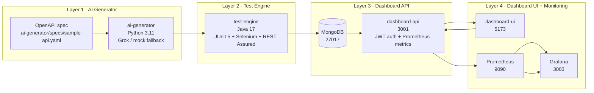
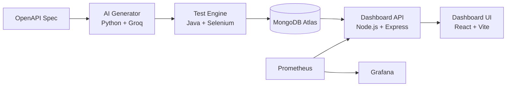

# QA Intelligence Platform

[](https://github.com/VishakhaGupta1/qa-intelligence-platform/actions/workflows/qa-pipeline.yml)
[]
[]

> AI-powered API and UI test generation, automated execution, and real-time quality intelligence dashboard.

## What It Does

The platform reads an OpenAPI specification, generates executable Java tests, and runs API plus UI validation against the application under test. Results are persisted to MongoDB so execution history, defects, and coverage can be tracked over time.

The four layers work together as a generation engine, an execution engine, a dashboard API, and a React UI. AI generates tests from the spec, Java executes them, the API stores and serves the results, and the dashboard shows coverage, defects, flakiness, and gap analysis.

What you see in the dashboard is the operational view of that pipeline: test volume, pass/fail trends, defect breakdowns, gap reports, and Prometheus-backed service metrics.

## Architecture



Layer 1 turns the API contract into tests. Layer 2 executes the generated Java suite and records results. Layer 3 exposes authenticated data and metrics. Layer 4 visualizes quality and system health.

## Quick Start

Prerequisites:

- Docker 24+
- Java 17+
- Python 3.11+
- Node 20+

1. Generate local secrets.

	```bash
	git clone https://github.com/VishakhaGupta1/qa-intelligence-platform.git
	cd qa-intelligence-platform
	bash scripts/generate-secrets.sh
	```

	Expected output: the repository is checked out, `.env` is created, and the script prints a checklist.

2. Start the local stack.

	```bash
	docker compose up -d --build
	```

	Expected output: MongoDB, dashboard-api, Selenium, Prometheus, and Grafana start.

3. Run the generator.

	```bash
	python ai-generator/main.py --spec ai-generator/specs/sample-api.yaml
	```

	Expected output: generated test sources are written to the test-engine module.

4. Run the Java suite.

	```bash
	mvn -f test-engine/pom.xml test
	```

	Expected output: `Tests run: 14, Failures: 0, Errors: 0, Skipped: 0`.

5. Run the Python unit tests.

	```bash
	python -m unittest discover -s ai-generator/tests -p "test_*.py"
	```

	Expected output: `Ran 8 tests` and `OK`.

6. Start the dashboard UI.

	```bash
	npm --prefix dashboard-ui run dev
	```

	Expected output: Vite serves the UI on `http://localhost:5173`.

7. Open the dashboard.

	```text
	http://localhost:5173
	```

## Environment Variables

### AI Generator

| Variable | Required | Default | Description |
| --- | --- | --- | --- |
| `GROK_API_KEY` | Yes | empty | Grok API key for test generation. |
| `GROK_URL` | No | `https://api.grok.ai/v1/generate` | Grok endpoint override. |
| `ANTHROPIC_API_KEY` | No | empty | Optional fallback key. |
| `BASE_URL` | No | `http://localhost:4000` | Application under test. |
| `HEADLESS` | No | `true` | Runs browser tests headlessly. |
| `USE_MOCK` | No | `true` | Uses mock AI responses for local development. |
| `ALLOW_MOCK_FALLBACK` | No | `true` | Allows mock output when no live provider is configured. |
| `SELENIUM_REMOTE_URL` | No | `http://127.0.0.1:4444/wd/hub` | Remote Selenium endpoint. |

### Test Engine

| Variable | Required | Default | Description |
| --- | --- | --- | --- |
| `BASE_URL` | No | `http://localhost:4000` | Target application base URL. |
| `HEADLESS` | No | `true` | Runs browser flows headlessly. |
| `SELENIUM_REMOTE_URL` | No | `http://127.0.0.1:4444/wd/hub` | Selenium endpoint for UI runs. |
| `MONGO_URI` | No | empty | MongoDB URI used by result persistence. |
| `MONGO_DB_NAME` | No | `qa_platform` | MongoDB database name. |

### Dashboard API

| Variable | Required | Default | Description |
| --- | --- | --- | --- |
| `PORT` | No | `3001` | API listen port. |
| `CORS_ORIGINS` | No | `http://localhost:5173,http://127.0.0.1:5173` | Allowed dashboard origins. |
| `JWT_SECRET` | Yes | empty | JWT signing secret. |
| `CLIENT_SECRET` | Yes | empty | Bootstrap secret for minting JWTs. |
| `JWT_EXPIRES_IN` | No | `1h` | JWT lifetime. |
| `METRICS_ALLOWED_SUBNETS` | No | `127.0.0.1,::1,172.16.0.0/12` | Allowlist for `/metrics`. |
| `MONGO_USERNAME` | No | `qa_platform_app` | MongoDB app username. |
| `MONGO_PASSWORD` | No | `change-me` | MongoDB app password. |
| `MONGO_HOST` | No | `127.0.0.1` | MongoDB host. |
| `MONGO_PORT` | No | `27017` | MongoDB port. |
| `MONGO_AUTH_SOURCE` | No | `qa_platform` | MongoDB auth database. |
| `MONGO_MAX_POOL_SIZE` | No | `20` | Driver pool size. |
| `MONGO_SERVER_SELECTION_TIMEOUT_MS` | No | `5000` | Server selection timeout. |
| `MONGO_CONNECT_TIMEOUT_MS` | No | `5000` | Connection timeout. |

### Dashboard UI

| Variable | Required | Default | Description |
| --- | --- | --- | --- |
| `VITE_API_BASE_URL` | No | `http://localhost:3001/api` | Base URL used by the React client. |

### Monitoring

| Variable | Required | Default | Description |
| --- | --- | --- | --- |
| `GRAFANA_ADMIN_PASSWORD` | Yes | `change-me-to-a-long-random-string` | Grafana admin password. |
| `BACKUP_DIR` | No | `/backups` | Mongo backup target directory. |

## Running Tests

Java API + UI suite:

```bash
mvn -f test-engine/pom.xml test
```

Expected output: `Tests run: 14, Failures: 0, Errors: 0, Skipped: 0`.

Python unit tests:

```bash
python -m unittest discover -s ai-generator/tests -p "test_*.py"
```

Expected output: `Ran 8 tests` and `OK`.

Full end-to-end pipeline:

```bash
docker compose up -d --build
# IntelliQA

[](https://github.com/VishakhaGupta1/Intelli_QA/actions/workflows/qa-pipeline.yml)
[]()
[](https://intelliqa-production.up.railway.app)

An end-to-end QA automation platform that reads an API spec, generates tests using AI, runs them, and shows results in a live dashboard.

## How it works

Give the platform an OpenAPI spec and the Python generator turns it into Java test cases with Groq-backed test generation. The Java test engine runs those tests against the real API and writes results to MongoDB. The dashboard API reads MongoDB and serves pass/fail rates, coverage gaps, flakiness, and defect data to the React dashboard in real time.

## Architecture



## Live demo

| Service | URL |
|---|---|
| Dashboard UI | https://intelliqa-production.up.railway.app |
| Dashboard API | https://intelliqa-dashboard-api-production.up.railway.app |
| Sample API | https://intelliqa-sample-api-production.up.railway.app |

## Stack

| Layer | Tech |
|---|---|
| AI Generator | Python, Groq API (Mixtral-8x7b) |
| Test Engine | Java 17, TestNG, RestAssured, Selenium 4 |
| Dashboard API | Node.js, Express, JWT, MongoDB |
| Dashboard UI | React, Vite, Recharts |
| Database | MongoDB Atlas |
| Monitoring | Prometheus, Grafana |
| CI/CD | GitHub Actions |
| Deployment | Railway |

## Quick start

**Prerequisites:** Docker 24+, Java 17+, Python 3.11+, Node 20+

```bash
# 1. Clone
git clone https://github.com/VishakhaGupta1/Intelli_QA.git
cd Intelli_QA

# 2. Generate secrets
bash scripts/generate-secrets.sh

# 3. Start everything
docker compose up -d --build

# 4. Seed demo data
node scripts/seed-mongo.js

# 5. Open dashboard
start http://localhost:5173
```

## Running tests

```bash
# Start the sample API first
cd sample-api && node server.js &

# Run the full test suite
mvn -f test-engine/pom.xml test
# Expected: Tests run: 17, Failures: 0

# Run Python unit tests
python -m unittest discover -s ai-generator/tests -p "test_*.py"
# Expected: Ran 8 tests - OK
```

## AI test generation

```bash
# Generate tests from the sample API spec (mock mode, no API key needed)
cd ai-generator
set USE_MOCK=true
python main.py --spec specs/sample-api.yaml

# With a real Groq API key (free at console.groq.com)
set GROQ_API_KEY=your_key_here
set USE_MOCK=false
python main.py --spec specs/sample-api.yaml
```

## Environment variables

Copy `.env.example` and fill in:

| Variable | Required | Description |
|---|---|---|
| `JWT_SECRET` | Yes | Min 32 chars, signs auth tokens |
| `CLIENT_SECRET` | Yes | Min 32 chars, used to get tokens |
| `MONGO_URI` | Yes | MongoDB connection string |
| `GROQ_API_KEY` | No | Groq API key (free tier works) |
| `USE_MOCK` | No | `true` to skip Groq and use mock |
| `GROQ_URL` | No | Default Groq chat completions endpoint |
| `BASE_URL` | No | API under test, default: sample-api |
| `UI_BASE_URL` | No | UI under test, default: demoblaze.com |
| `HEADLESS` | No | Run browser headless, default: true |

## API endpoints

All endpoints require `Authorization: Bearer <token>` except `/health`, `/ready`, `/metrics`, and `/api/auth/token`.

| Method | Path | Description |
|---|---|---|
| POST | /api/auth/token | Get JWT token |
| GET | /health | Health check |
| GET | /ready | Readiness check |
| GET | /metrics | Prometheus metrics |
| GET | /api/results | Test results |
| GET | /api/metrics | Aggregated metrics |
| GET | /api/coverage | Endpoint coverage |
| GET | /api/flakiness | Flaky tests |
| GET | /api/defects | Defect logs |
| GET | /api/gap-report | Coverage gaps |

Get a token:

```bash
curl -X POST https://intelliqa-dashboard-api-production.up.railway.app/api/auth/token \
  -H "Content-Type: application/json" \
  -d '{"client_secret":"your-CLIENT_SECRET"}'
```

## Monitoring

Start the monitoring stack:

```bash
docker compose -f docker-compose.yml -f docker-compose.override.yml up -d
```

| Service | URL | Credentials |
|---|---|---|
| Grafana | http://localhost:3003 | admin / GRAFANA_ADMIN_PASSWORD |
| Prometheus | http://localhost:9090 | none |

## Deployment

This project deploys to Railway using `railway.json`. See [DEPLOYMENT.md](DEPLOYMENT.md) for the step-by-step guide.

Required Railway environment variables:
- `JWT_SECRET`, `CLIENT_SECRET`, `MONGO_URI`, `NODE_ENV`, `PORT`

See [.github/ENVIRONMENT_SETUP.md](.github/ENVIRONMENT_SETUP.md) for GitHub Actions secrets setup.

## Security

- JWT Bearer token authentication on all API routes
- Rate limiting: 500 req/15min globally, 30 req/min on auth
- PII redaction before any data reaches the Groq API
- Secrets fail-fast: server exits on startup if JWT_SECRET or CLIENT_SECRET are missing
- See [docs/security-hardening-guide.md](docs/security-hardening-guide.md)

## Project structure

```text
IntelliQA/
├── ai-generator/          # Python: reads spec, calls Groq, writes Java tests
├── dashboard-api/         # Node.js: REST API, JWT auth, MongoDB queries
├── dashboard-ui/          # React: live metrics dashboard
├── test-engine/           # Java: runs API + UI tests, writes results to Mongo
├── sample-api/            # Node.js: demo API that IntelliQA tests against
├── db-init/               # MongoDB init scripts and index verification
├── monitoring/            # Prometheus + Grafana config and dashboards
├── scripts/               # Backup, restore, seed, and secret rotation scripts
├── docs/                  # Architecture, API reference, runbook, security guide
├── .github/               # CI/CD workflow and environment setup guide
├── docker-compose.yml     # Main stack: MongoDB, API, Selenium, sample-api
└── docker-compose.override.yml  # Monitoring overlay: Prometheus + Grafana
```
