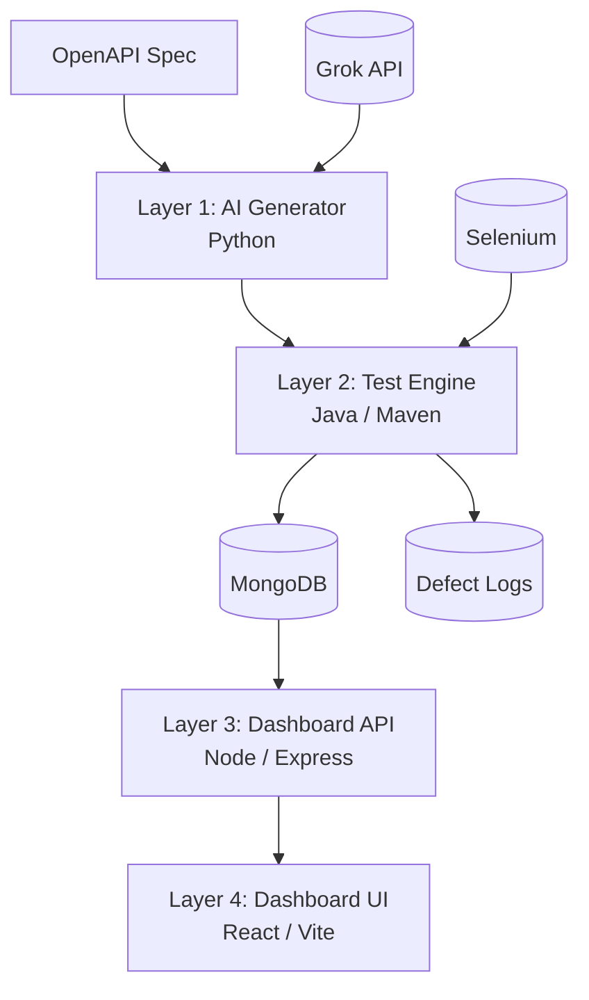
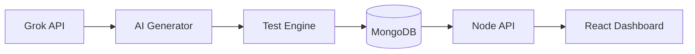
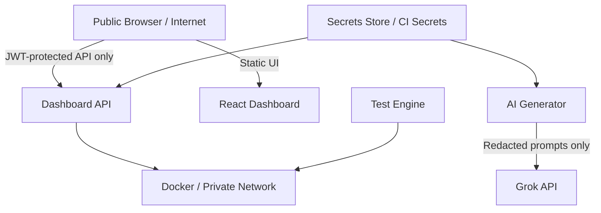

# Architecture Documentation

## System Overview
The platform is a layered QA automation system built as a monorepo. Each layer is independently testable and can be containerized, but the whole system behaves like a coordinated application rather than a set of unrelated services.

## Architecture Diagram

## Data Flow
1. The user provides an OpenAPI spec.
2. `ai-generator/spec_parser.py` normalizes endpoints.
3. `ai-generator/prompt_builder.py` builds endpoint-specific prompts.
4. `ai-generator/claude_client.py` calls Grok first and falls back to Anthropic or mock output when configured.
5. `ai-generator/test_writer.py` writes Java tests into the test-engine module.
6. `mvn test` executes API and UI tests.
7. Test results and defects are persisted to MongoDB.
8. `dashboard-api` reads MongoDB and serves JSON to the React UI.
9. The React UI renders coverage, defects, trends, flakiness, and gap reports.

## Security Boundaries

## PII Redaction Boundary
- Only schema information, safe example values, and redacted prompt fragments leave the system for Grok.
- Denied fields such as passwords, secrets, tokens, SSNs, emails, and phone numbers are fully redacted.
- Allowed fields such as HTTP method, path, and status code pass through unchanged.
- The redaction boundary is enforced in `ai-generator/pii_redactor.py` before prompt serialization.

## Component Interactions
- Python generator writes code that the Java test engine consumes.
- Java tests write runtime results back into MongoDB.
- Node API is the read model over the test results.
- React UI is a presentation layer over the API.
- Docker Compose supplies MongoDB and Selenium infrastructure for local runs.
- GitHub Actions runs the same pipeline in CI.

## Technology Choices
- **Python** for spec parsing and LLM orchestration because it is fast to iterate and easy to script.
- **Java 17 + Maven** for generated tests because JUnit, Rest Assured, and Selenium are stable and enterprise-friendly.
- **Node + Express** for lightweight JSON aggregation and API serving.
- **React + Vite** for a fast dashboard UI.
- **MongoDB** for flexible test-result documents and gap reports.
- **Docker Compose** for local reproducibility.
- **GitHub Actions** for repeatable CI.

## Design Rationale
- The generator/test-engine split keeps LLM orchestration separate from test execution.
- MongoDB is a good fit for semi-structured test run data.
- The dashboard API acts as a thin data-access layer so the UI stays simple.
- The system is optimized for operational visibility rather than only pass/fail reporting.
